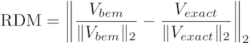
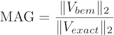
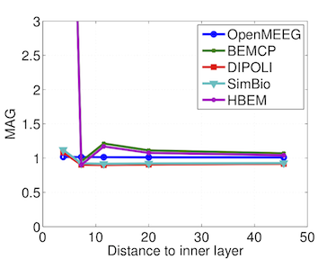

.. _why_openmeeg:

======================
Why use OpenMEEG?
======================

OpenMEEG offers better precision.

How do you measure precision?
-----------------------------

Relative difference measure (RDM) *(should be close to 0)* and Magnitude error (MAG) *(should be close to 1)*:

.. math:: \mathbf{MAG} = \left\| \frac{V_{bem}}{\|V_{bem}\|_2} - \frac{V_{exact}}{\|V_{exact}\|_2} \right\| \,,\, \mathbf{RDM} = \frac{\|V_{bem}\|_2}{\|V_{exact}\|_2}

A sample sphere model with 5 dipoles:

|center-div|   |sphere_dipoles|   |sphere_dipoles_zoom|   |end-div|

Benchmark: OpenMEEG outperforms other implementations
-----------------------------------------------------

|center-div|   |mag_bench|   |rdm_bench|   |end-div|

See the following publication for more details on this comparison between different forward solvers:

    A. Gramfort, T. Papadopoulo, E. Olivi, M. Clerc. OpenMEEG: opensource software for quasistatic bioelectromagnetics, `BioMedical Engineering OnLine 45:9, 2010 <http://www.biomedical-engineering-online.com/content/9/1/45>`_

.. |center-div| raw:: html

    

.. |sphere_dipoles| image:: _static/sphere_dipoles_3D.png
   :alt: Sphere model with 5 dipoles
   :width: 250px

.. |sphere_dipoles_zoom| image:: _static/sphere_dipoles_3D_zoom.png
   :alt: Sphere model with 5 dipoles (zoom)
   :width: 200px

.. |rdm_bench| image:: _static/bem_comparison_rdms.png
   :alt: BEM Comparison RDMs

.. |end-div| raw:: html

  

